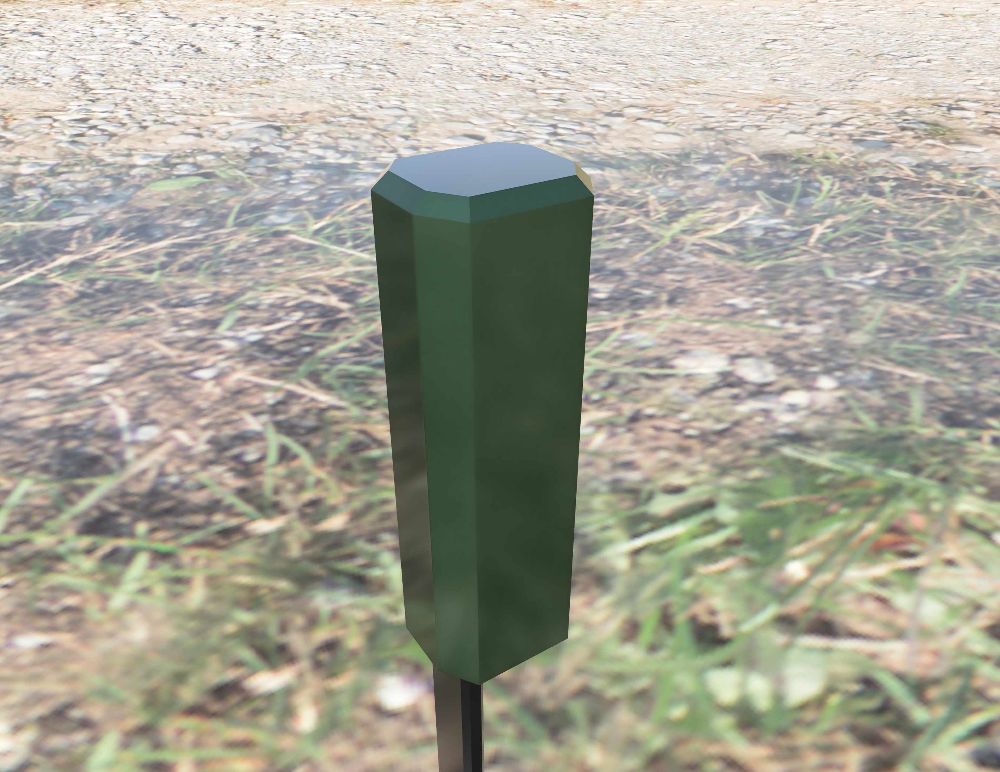
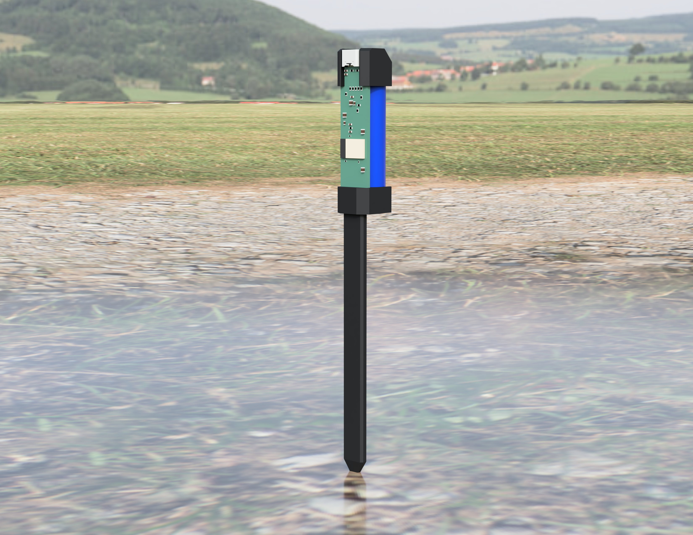
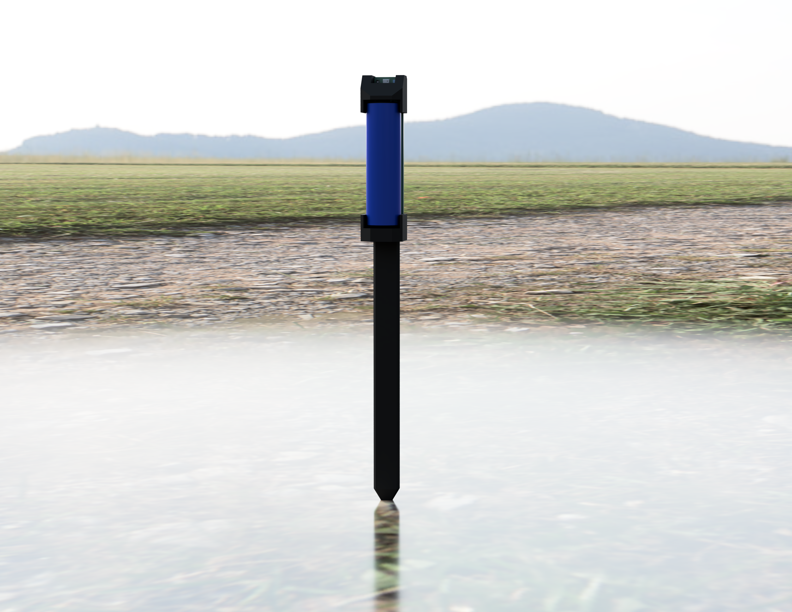

# ARC Probe

ARC Probe is a small, battery-powered environmental sensing probe for plants, classrooms, and experimental climate learning.

This repository is the public design and concept marker for the ARC Probe hexagonal prototype direction. It documents the current product intent, visual design language, and proof-of-work status without publishing firmware, PCB files, mechanical CAD, BOM, manufacturing notes, or app source before launch.

## Why ARC Probe

Plants are quiet witnesses to the indoor climate around us. They respond to light, temperature, humidity, soil conditions, watering patterns, and the invisible comfort of a room long before those patterns become obvious to people.

ARC Probe is being developed as a graceful way to make that relationship visible. It can stand alone beside a plant and stream live environmental data to an iOS app, while also becoming part of more ambitious classroom and KlimaLap experiments where students can observe how indoor air quality, plant health, human comfort, and climate choices relate to each other over time.

The aim is not to turn classrooms into dashboards for their own sake. The aim is to give learners and caretakers a tangible object that connects living systems with measurable signals: air, light, humidity, temperature, soil, power, and time.

## Prototype Status

The ARC Probe prototype is already up and running.

Current validated prototype capabilities include:

- Battery-powered embedded hardware bring-up.
- Live sensor data flowing over BLE.
- iOS app discovery, connection, and telemetry display.
- Environmental measurements from the sensor island, including temperature, humidity, pressure, gas response, light/RGB, and soil/proximity experiments.
- Power and charge-management bring-up for a compact rechargeable form factor.
- A developing mechanical direction around a hexagonal outer body and internal battery fixture.

This is still a prototype platform, not a launched consumer product. Measurements, calibration, enclosure details, and final feature boundaries are still evolving.

## The Design Direction

The current design direction uses a hexagonal body language: precise enough to feel engineered, simple enough to live near plants and learning spaces without looking like lab equipment dropped into a room.

The internal battery fixture is part of that direction. It keeps the product compact, serviceable, and physically honest: a real embedded object with power, sensing, wireless data, and enclosure constraints designed together.

The concept is indoor-first, but the closed shell direction keeps a possible outdoor path open if material choice, sealing, and electronics protection are developed carefully. See [Outdoor Use Design Note](docs/design/outdoor-use.md).

## Plants And Indoor Air Quality

Indoor air quality is often treated as an abstract number on a wall sensor. ARC Probe approaches it from a more grounded angle: the plant, the room, and the learner are in the same environment.

For homes, studios, and classrooms, this makes the data easier to care about:

- Temperature and humidity become part of plant comfort and human comfort.
- Light becomes both a growth condition and a room-quality signal.
- Soil and watering patterns connect daily behavior to living feedback.
- Gas-response experiments can support discussion about ventilation, activity, and changes in the room.
- Long-running data makes climate patterns visible instead of anecdotal.

ARC Probe is intended to be useful as a standalone companion for plants, but its larger potential is as a small node in shared experiments: many probes, many rooms, many plant conditions, and a more curious way to talk about climate where people actually live and learn.

## KlimaLap Potential

KlimaLap is the broader experimental direction: a learning and research concept where classrooms can become gentle climate laboratories.

With ARC Probe, a class could compare plant environments across windowsills, shelves, rooms, seasons, watering routines, ventilation habits, and light exposure. The same object can invite both technical and ecological questions:

- What does a healthy indoor microclimate look like?
- How do plants and rooms respond during the school day?
- Can students design better care routines from real data?
- How do ventilation, light, humidity, and occupancy interact?
- What can a living classroom teach that a static chart cannot?

The prototype dataflow to iOS is an important milestone because it makes the experiment immediate: a physical object, a living plant, and live data in the hand.

## Public Scope Of This Repository

This repository is public so the ARC Probe concept, design direction, and development timestamp are visible.

For now, this repository intentionally contains:

- Public-facing concept documentation.
- Rendered images of the selected hexagonal design direction.
- High-level prototype status.

This repository intentionally does not contain:

- Firmware source code.
- iOS app source code.
- PCB, schematic, Gerber, or BOM files.
- Mechanical CAD or manufacturing files.
- Calibration procedures or production test details.
- Private logs, local device identifiers, or provisioning data.

Code and deeper technical material may be released later in a curated form when the product direction and launch boundary are ready.

## Ownership And Rights

ARC Probe, the design direction shown here, and the included render assets are published as public project documentation by Arc-motion.

No open-source license is granted for the hardware design, mechanical design, render assets, firmware, app code, or product concept by this repository. All rights are reserved unless a future file in this repository explicitly says otherwise.

## Looking Forward

ARC Probe is being built from working prototype reality: sensors, battery power, BLE, and iOS dataflow are already alive. The next step is to keep refining the product, explore the classroom and plant-care potential further, and shape the public release path with care.

We look forward to exploring what this small object can teach us about plants, rooms, climate, and the way people learn from living systems.
